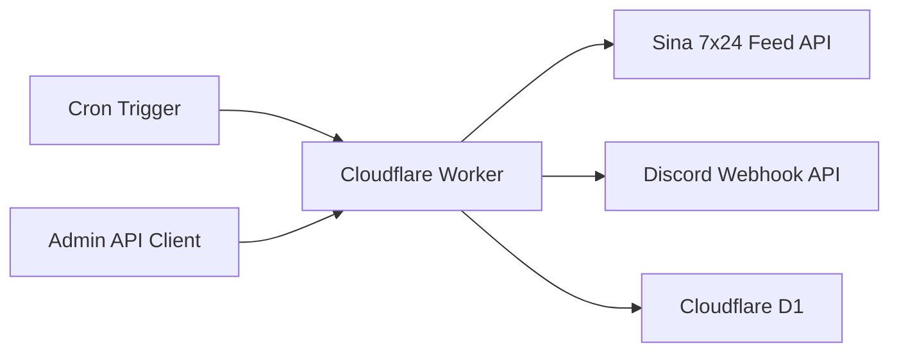
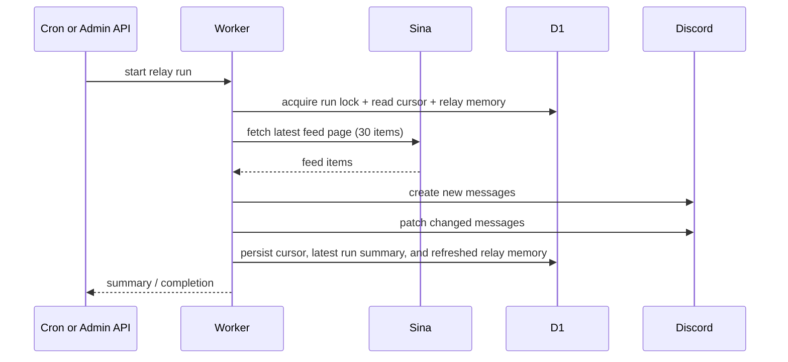

# Architecture

## Goal

This repository turns the Discord relay from the browser-driven `sina7x24` viewer into a standalone Cloudflare Worker service.

The main boundaries are:

- the Worker owns scheduling, secrets, state, and Discord delivery
- Sina remains the upstream feed source
- D1 stores relay cursor, one latest run summary, a run lock, and recent item-level relay memory
- the browser is no longer required for automatic relay

## System Overview

## Repository Layout

- `src/index.js`
  Worker entry. It exposes:
  - `fetch()` for health, status, and manual relay routes
  - `scheduled()` for cron-driven relay runs
- `src/config.js`
  Reads runtime vars and validates required bindings and secrets.
- `src/http.js`
  Holds HTTP response helpers, auth checks, and timeout-aware fetch.
- `src/sina.js`
  Builds feed URLs and fetches the latest Sina feed page.
- `src/discord.js`
  Validates webhook URLs and performs Discord create/update requests.
- `src/store.js`
  Persists state in D1.
- `src/relay.js`
  Coordinates one relay run end-to-end.
- `migrations/0001_initial.sql`
  Creates the initial D1 schema.

## Runtime Flow

## D1 Schema

The Worker uses two data shapes in D1:

- `relay_state`
  Key-value state such as the last processed Sina item ID, the latest run summary, and the active run lock.
- `relay_items`
  Relay memory keyed by Sina `item_id`, including the Discord message mapping, normalized source fingerprint, and seen/relayed timestamps.

## Relay Rules

The current relay rules are:

- fetch the latest Sina feed page once per run
- on the very first successful run, seed the cursor to the latest item and skip backlog delivery
- acquire a D1-backed run lock so overlapping cron/manual executions cannot relay the same fresh item twice
- create Discord messages for items newer than the stored cursor
- treat each Sina `item_id` as an independent relay target
- patch previously relayed Discord messages only when the same item's normalized source fingerprint changes
- keep relay memory fresh by updating `last_seen_at` even when no Discord write is needed
- persist the highest successfully relayed item ID as the new cursor
- keep only one latest run summary in `relay_state`
- delete `relay_items` rows that have not been seen again for 7 days

## Public And Admin Surface

- `GET /healthz`
  Public health response.
- `GET /api/status`
  Admin-only snapshot of runtime config, the latest run summary, the active lock, and recent relay memory.
- `POST /api/run`
  Admin-only manual relay trigger.

Admin routes use bearer-token auth unless local unauthenticated admin mode is explicitly enabled.

## Why D1

This repository uses D1 instead of browser memory because the relay needs durable state:

- the latest processed feed cursor
- the latest run summary for operational visibility
- the active run lock that prevents overlapping delivery
- the Discord message ID for recently seen Sina items
- the normalized source fingerprint used to decide whether an existing Discord message needs a patch during the retention window

## Relationship To The Main Viewer Repo

The `sina7x24` repository still makes sense for:

- the browser viewer
- same-origin local proxying for feed and avatar requests
- local debugging of viewer behavior

This repository takes over the part that is operationally server-side:

- secret-managed Discord webhook usage
- scheduled polling
- durable relay state
- browser-independent automation
