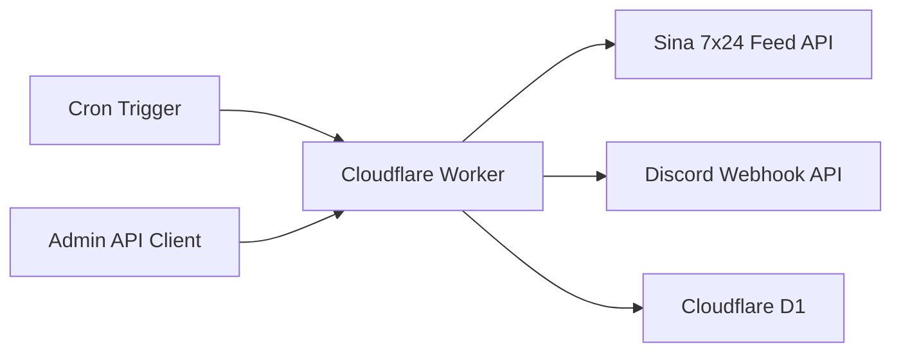
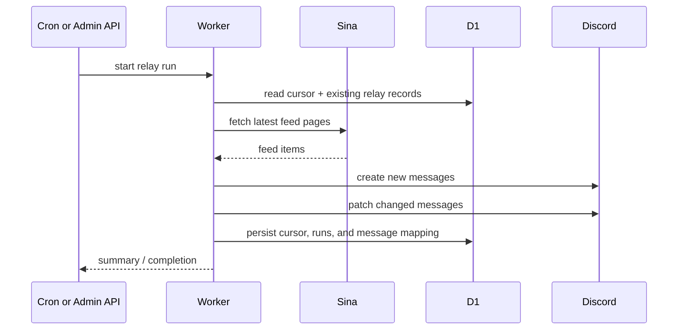

# Architecture

## Goal

This repository turns the Discord relay from the browser-driven `sina7x24` viewer into a standalone Cloudflare Worker service.

The main boundaries are:

- the Worker owns scheduling, secrets, state, and Discord delivery
- Sina remains the upstream feed source
- D1 stores relay cursor, run history, and item-to-message mapping
- the browser is no longer required for automatic relay

## System Overview

## Repository Layout

- `src/index.js`
  Worker entry. It exposes:
  - `fetch()` for health, status, and manual relay routes
  - `scheduled()` for cron-driven relay runs
- `src/config.js`
  Reads runtime vars and validates required bindings and secrets.
- `src/http.js`
  Holds HTTP response helpers, auth checks, and timeout-aware fetch.
- `src/sina.js`
  Builds feed URLs, fetches paginated Sina data, and normalizes feed items.
- `src/discord.js`
  Validates webhook URLs and performs Discord create/update requests.
- `src/store.js`
  Persists state in D1.
- `src/relay.js`
  Coordinates one relay run end-to-end.
- `migrations/0001_initial.sql`
  Creates the initial D1 schema.

## Runtime Flow

## D1 Schema

The Worker uses three tables:

- `relay_state`
  Key-value state such as the last processed Sina item ID.
- `relay_runs`
  One record per relay execution with trigger type, counters, and errors.
- `relay_items`
  The durable mapping from Sina `item_id` to Discord `message_id`, plus the last sent content hash.

## Relay Rules

The current relay rules are:

- fetch a bounded number of recent Sina feed pages each run
- on the very first successful run, seed the cursor to the latest item and skip backlog delivery
- create Discord messages for items newer than the stored cursor
- patch previously relayed Discord messages if the upstream content hash changes
- persist the highest successfully relayed item ID as the new cursor

## Public And Admin Surface

- `GET /healthz`
  Public health response.
- `GET /api/status`
  Admin-only snapshot of runtime config and D1 state.
- `POST /api/run`
  Admin-only manual relay trigger.

Admin routes use bearer-token auth unless local unauthenticated admin mode is explicitly enabled.

## Why D1

This repository uses D1 instead of browser memory because the relay needs durable state:

- the latest processed feed cursor
- the Discord message ID for each relayed Sina item
- the last content hash used to decide whether an update needs a Discord patch
- a run history that survives browser refreshes and machine restarts

## Relationship To The Main Viewer Repo

The `sina7x24` repository still makes sense for:

- the browser viewer
- same-origin local proxying for feed and avatar requests
- local debugging of viewer behavior

This repository takes over the part that is operationally server-side:

- secret-managed Discord webhook usage
- scheduled polling
- durable relay state
- browser-independent automation
